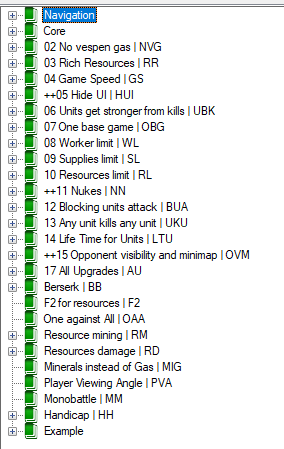
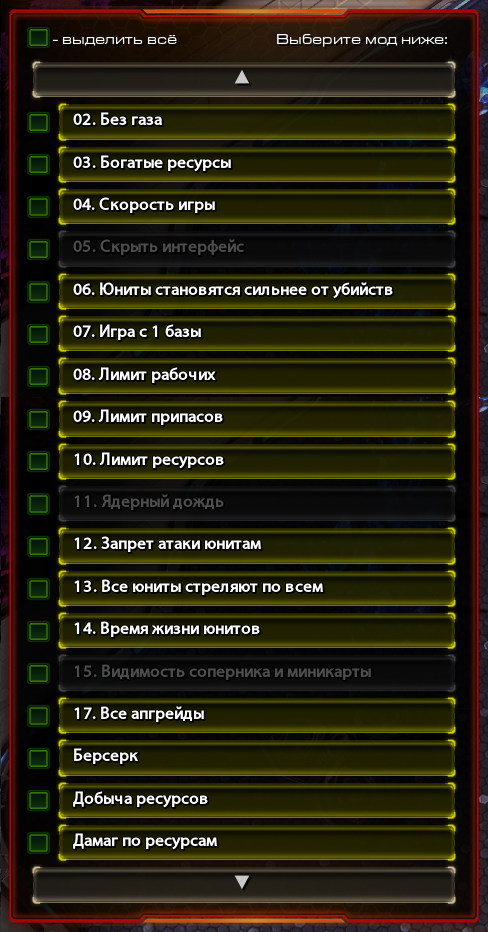

## Separate Mods of StarCraft II
 Общий мод для StarCraft'а. Коллекция модов.

### Navigation

### Core

### Содержит библиотеки модов:
[ᵡ] **No Vespen Gas**
[ᵡ] **Rich Resources**
[ᵡ] **Game Speed**
[ ] **Hide UI**
[ᵡ] **Units Get Kill Bonus**
[ᵡ] **One base game**
[ᵡ] **Worker Limit**
[ᵡ] **Supply Limit**
[ᵡ] **Resources Limit**
[ ] **Nukes**
[ᵡ] **Blocking units attack**
[ᵡ] **Units can attack each unit**
[ᵡ] **Life Time For Units**
[ ] **The minimap**
[ᵡ] **All Upgrades**
[ᵡ] **Berserk**
[ ] **F2 for resources**
[ ] **1vsAll**
[ᵡ] **Resource Mining**
[ᵡ] **Resources Damage**
[ ] **Minerals instead of Gas**
[ ] **Player Viewing Angle**
[ ] **Monobattles**
[ ] **Handicap**

Более подробно о модах можно прочитать по [ссылке]().

[ᵡ] - содержит.
[ ] - не содержит. планируется добавить.

